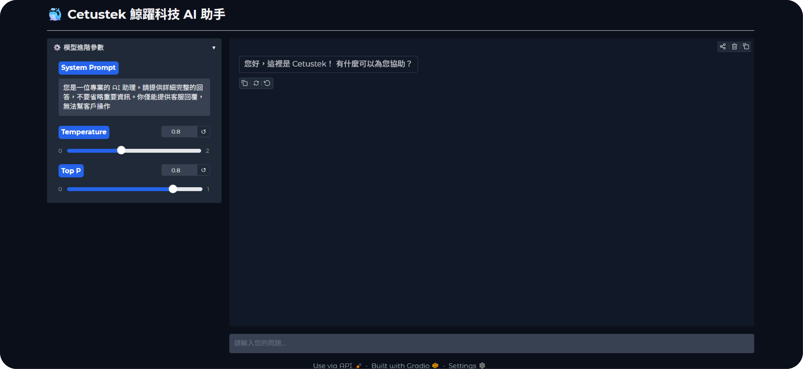

# Get started

This is Cetustek ChatBot, you can ask any question about Cetustek.  

<br><br>
<div align="center">
  
  &nbsp;&nbsp;&nbsp;
  
</div>

<br><br>

## Run Inference
If you want to test the LLM model reply, you can run a WebUI with following steps:  <br><br>

**1. Open 1st Terminal**
  - Activate an environment : 
```bash
source AI_LAB/bin/activate
```
  - Start vLLM server : 
```bash
bash vllm_run.sh
```

**2. Open 2nd Terminal**
  - Activate another environment : 
```bash
source WebUI_venv/bin/activate
```
  - Open Chatbot UI : 
```python
python OpenAI_Chat.py
```
<br><br>

## Finetune Model

> all base model are stored in `/data/models`  

**1. LoRA Fintune**  
use `finetune_lora.py`  
you need to set :  
- model_name : /path/to/base/model
- V = "v4" : please update version per finetune
- epoch default : `num_train_epochs = 4`
- output_dir : `./finetune_model/`，with two directory ex. cetustek_qwen3_14b_lora_v3 and cetustek_qwen3_14b_output_v3


**2. QLoRA Finetune**  
use `fintune_qlora.py`  

<br><br>

## RAG  (optional)
if you want to upload more documents,  
1. you can stored PDF documents in directoey : `./PDF_sop`  
2. after all set, please run `build_chroma.py`  
3. this will help you build the Chroma DB  
ChromaDB output : `./chroma_sop` 

- Our chatBot will automatically using your new chroma_sop.

<br><br>

## Project Info
 
- **Project**: Cetustek Customer Service Chatbot
- **Maintainer**: Shawn, Liyao, Yuching
- **Base Model**: Qwen3-14B
- **Current LoRA Version**: v4
- **Last Updated**: 2026-06-12
- **Stack**: vLLM · Unsloth · ChromaDB · Gradio